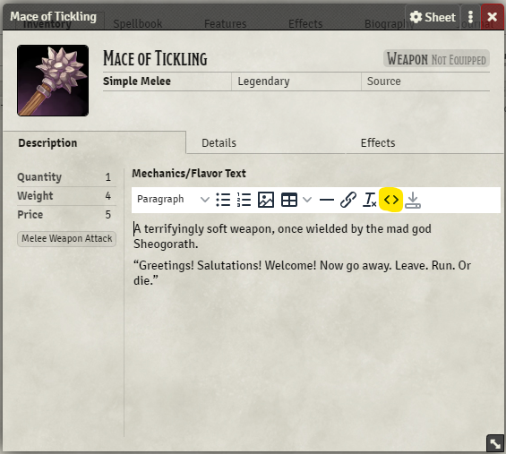
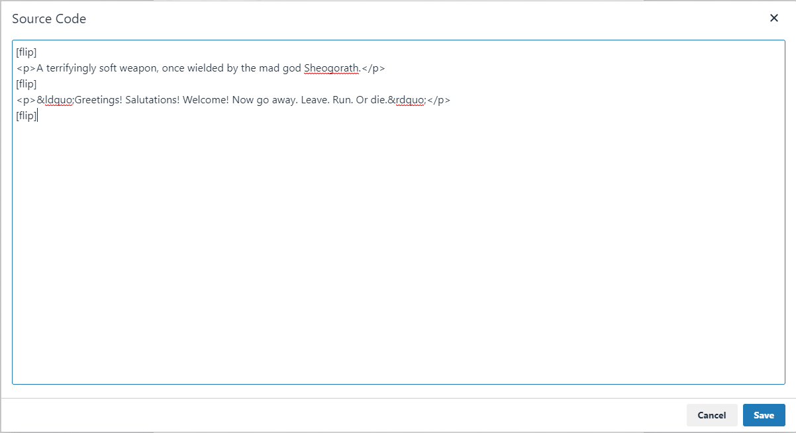
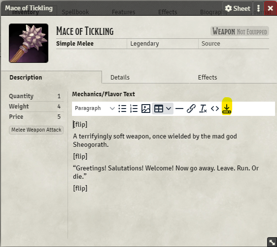
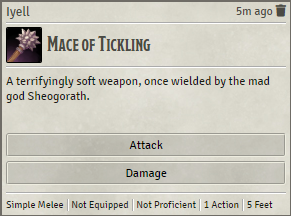
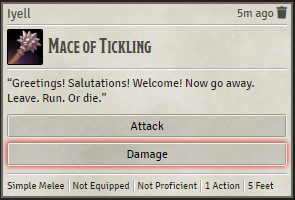

# Multi-part Messages

<!--- Downloads @ Latest Badge -->
<!--- replace <user>/<repo> with your username/repository -->
<!---  -->

<!--- Forge Bazaar Install % Badge -->
<!--- replace <your-module-name> with the `name` in your manifest -->
<!---  -->

This module enables divding chat messages into multiple parts. The next part of a message is revealed by double clicking.
This is useful for implementing spell cards with images, for example, as the cards can be flipped over to reveal flavour text, rather
than keeping the image and text visible at all times.

## Usage

After installing the module, type a message in chat and separate the "parts" of the message like so:

``[flip]Hello[flip]world![flip]``

This example will produce the text `Hello`, which you can double click to change to `world!`.
Note that you need to start and end your message with `[flip]`, as well as the `[flip]`
in the middle to separate the two parts of the message.

Using this on item or spell cards is almost the same. Let's look at an example:

1. Fill in the card's flavour text as per usual. When you're satisfied with the flavour text, click the
button to edit the flavour text source code.

    

2. Add `[flip]` delimiters, just like with the chat messages example. Remember to start and finish the message with `[flip]`s.

    

3. Save the changes to the source code by pressing the blue save button, and then save the flavour text as a whole.

    

4. Use the item as per usual. You can double click on the flavour text in chat to flip to the second part of the description.

   
   

## Changelog

1.0.0: First release!
